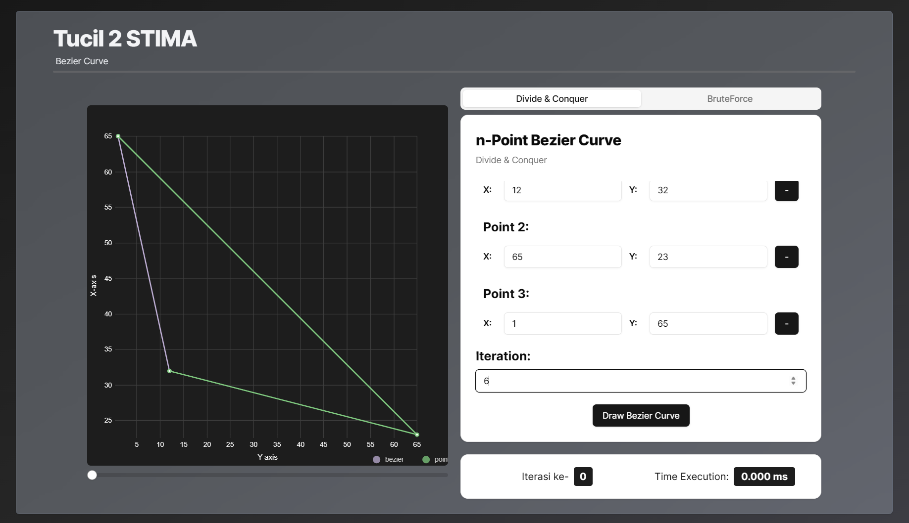

# Project Name
> Bezier Curve Program using Divide and Conquer Algorithm
> Live demo [_here_](https://www.example.com). <!-- If you have the project hosted somewhere, include the link here. -->


## Table of Contents
* [General Info](#general-information)
* [Technologies Used](#technologies-used)
* [Features](#features)
* [Screenshots](#screenshots)
* [Usage](#Usage)
* [Project Status](#project-status)
* [Room for Improvement](#room-for-improvement)
* [Acknowledgements](#acknowledgements)


## General Information
- Bezier Curve Maker with n control points
- Create Bezier Curve using Divide and Conquer Algorithm


## Technologies Used
- Next.js


## Features
List the ready features here:
- Bezier Curve n points
- Bezier Curve Divide and Conquer 
- Bezier Curve Bruteforce  


## Screenshots



## Usage
1. change the terminal directory to the root directory of `kurva-bezier`
  ```sh
  cd src/kurva-bezier
  ```
3. install dependencies
  ```
  npm i
  ```
4. run app
  ```
  npm run dev
  ```


## Project Status
Project is: _complete_


## Room for Improvement
Room for improvement:
- Responsiveness

To do:
- Display Time Execution Properly


## Acknowledgements
| NIM | Name | Linkedin |
| :---: | :---: | :---: |
| 13522161 | Mohamad Akmal Ramadan | [LinkedIn](https://www.linkedin.com/in/akmalrmn/) |
| 13522164 | Valentino Chryslie Triadi | [LinkedIn](https://www.linkedin.com/in/valentinotriadi/) |
